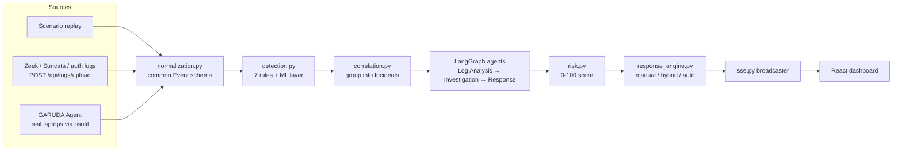

# GARUDA — Agentic AI Cybersecurity Assistant

GARUDA ingests security telemetry, detects threats, correlates them into incidents,
runs a multi-agent investigation over each incident, scores its risk, and (optionally)
takes containment actions — all streamed live to a React dashboard.

It is a working prototype built around one architectural rule: **every telemetry source
— replayed scenarios, uploaded Zeek/Suricata/auth logs, and real laptops running a
lightweight agent — flows through the same single pipeline.** There is no source-specific
logic anywhere downstream of normalization, so a demo scenario and a real sensor produce
identical incidents, risk scores, and agent output.

> **Scope note.** All response actions (block IP, isolate host, disable account, …) act
> only on GARUDA's own *simulated* enterprise inventory in its local database. No code
> path reaches a real firewall, identity provider, or cloud account.

---

## Highlights

- **One shared pipeline** — `normalize → detect → correlate → investigate → score → respond → stream`,
  with a single entry point: `process_raw_event()` in [backend/app/pipeline.py](backend/app/pipeline.py).
- **Hybrid detection** — 7 deterministic rules mapped to MITRE ATT&CK, plus an ML layer:
  an unsupervised, self-calibrating `IsolationForest` and an optional offline-trained
  supervised `RandomForest` (CICIDS2017).
- **Incident correlation** — detections merge into a single multi-stage attack narrative
  (recon → brute force → login → privilege escalation → C2) by shared entities.
- **LangGraph agent pipeline** — three agents (Log Analysis → Threat Investigation → Response),
  evidence-grounded: every sentence traces back to stored detections, never invented.
- **Explainable 0–100 risk score** whose per-factor breakdown is returned by the API and printed in the PDF report.
- **Policy-gated response engine** — `manual` / `hybrid` / `auto` modes, an analyst
  approval queue, an audit log, and one-click rollback for reversible actions.
- **Real-time dashboard** — Server-Sent Events push every event, detection, incident,
  and action to a React UI with an interactive network topology map and live packet flow.
- **Real multi-device exercise** — a `psutil`-based agent turns real laptops on your LAN
  into live topology nodes; GARUDA flags the attacker from behavior alone.
- **Reports** — one-click PDF incident report and a copy-paste markdown summary.

---

## Architecture



Per raw event, `process_raw_event` does the following, in order:

1. Normalize the raw record into the common `Event` schema and persist it.
2. Synthesize packet-level frames for the topology view (`packet_simulator.py`).
3. Run every detection rule; each hit becomes a `Detection`.
4. If a detection's source IP matches a registered laptop, flag it as an attacker (`live_agents.mark_attacker`).
5. Correlate the detection into a new or existing `Incident`.
6. Run the LangGraph investigation and recompute risk.
7. Escalate affected asset status (`healthy → at_risk → compromised`).
8. Let the response engine execute, queue, or ignore each recommended action per policy.
9. Broadcast every resulting message over SSE.

---

## Tech stack

| Layer | Technology | Used for |
|---|---|---|
| API | **FastAPI** 0.115, **Uvicorn** | REST endpoints, SSE stream, CORS |
| Data | **SQLAlchemy** 2.0, **SQLite** | ORM, JSON columns for evidence/timelines; swappable via `DATABASE_URL` |
| Validation | **Pydantic** 2 | Response schemas (UTC-safe datetimes via a shared `UtcDatetime` alias) |
| Agents | **LangGraph** 0.2 | `StateGraph` orchestrating three agent nodes over a shared typed state |
| ML | **scikit-learn** 1.7, NumPy, joblib, pandas | `IsolationForest`, `RandomForestClassifier`, offline training pipeline |
| Streaming | **sse-starlette** | Server-Sent Events fan-out to dashboard clients |
| Reports | **ReportLab** | PDF incident reports |
| Frontend | **React** 18, **Vite** 5 | Dashboard SPA |
| Visualization | **reactflow** 11, **recharts** 2 | Topology map, severity/threat distribution charts |
| Agent | **psutil**, requests | Real-machine telemetry collector (no admin rights, no packet capture) |
| Styling | Plain CSS with design tokens | Severity color scale defined once in `index.css` |

---

## Project structure

```
garuda/
├── backend/
│   ├── app/
│   │   ├── main.py               FastAPI app, CORS, routers, startup hooks
│   │   ├── pipeline.py           process_raw_event — the single shared pipeline
│   │   ├── normalization.py      Per-source normalizers -> common Event schema
│   │   ├── detection.py          Rule engine (RULES list) + ML rule
│   │   ├── ml_detection.py       IsolationForest + optional supervised model
│   │   ├── correlation.py        Detections -> Incidents
│   │   ├── risk.py               0-100 risk score + severity bands
│   │   ├── response_engine.py    Policy-gated action executor with rollback
│   │   ├── assets.py             Asset status escalation, destination lookup
│   │   ├── live_agents.py        Real-laptop registration, heartbeat, attacker flagging
│   │   ├── packet_simulator.py   Packet-level SSE frames for the topology view
│   │   ├── report.py             PDF + markdown incident reports
│   │   ├── mitre.py              Technique-key -> MITRE ATT&CK ID/name
│   │   ├── sse.py                Pub/sub broadcaster
│   │   ├── models.py / schemas.py / database.py / config.py
│   │   ├── agents/               LangGraph nodes: state, log_analysis, threat_investigation, response, graph
│   │   ├── scenarios/            Attack scenarios, simulated topology seed, replay player
│   │   └── routers/              logs, live, events, incidents, status, topology, actions, policy, agents
│   ├── ml_training/              Offline CICIDS2017 -> supervised model pipeline
│   ├── smoke_test.py             End-to-end pipeline + response-policy checks
│   └── requirements.txt
├── frontend/                     React (Vite) dashboard
│   └── src/  App.jsx, api.js, useLiveStream.js, components/, index.css
└── agent/
    └── garuda_agent.py           Lightweight collector for real laptops
```

---

## Implementation details

### 1. Ingestion and normalization

[normalization.py](backend/app/normalization.py) holds one function per source, registered in a
`NORMALIZERS` dict: `zeek` (conn/dns/http/ssl/ssh), `suricata` (EVE JSON alerts), `auth`
(SSH auth success/failure), `scenario` (built-in replay), and `agent` (real laptop telemetry).
Each returns a dict matching the `Event` ORM columns; missing fields become `None` rather than
raising, so a partial record never breaks the pipeline. The original payload is kept in
`raw_event_reference` as evidence. Adding a new source means writing one normalizer and
registering it — nothing downstream changes.

`Event.conn_status` carries the TCP handshake outcome (psutil status or Zeek `conn_state`)
for sources that can observe it. It powers false-positive suppression (see below).

### 2. Detection engine

[detection.py](backend/app/detection.py) exposes a `RULES` list; each rule takes the new event plus
a recent window from the database and returns a `Detection` or `None`. A shared
`_already_detected` guard stops the same threat from re-firing inside its window.

| Rule | Fires when | Severity | MITRE ATT&CK |
|---|---|---|---|
| SSH Brute Force | ≥ 5 auth failures from one source in 120 s | high | T1110 |
| Port Scan | ≥ 8 distinct ports on a *single* destination in 60 s | medium | T1046 |
| Denial of Service Flood | ≥ 30 connections to one destination in 8 s | critical | T1498 |
| Possible Credential Compromise | auth success right after ≥ 5 failures (same source → target) | critical | T1078 |
| Privilege Escalation | privilege-escalation event observed | high | T1068 |
| Suspicious Outbound Communication | suspicious-outbound event (C2-style) | high | T1071 |
| Web Attack | Suricata IDS alert | from alert | T1190 |
| Anomalous Network Behavior (ML) | ML layer flags the source's window | medium / high | none (see below) |

Thresholds live in [config.py](backend/app/config.py).

**Reducing false positives on real traffic.** A real laptop with many browser tabs can look
like a scan or flood. Two mitigations are built in:

- Port-scan *breadth is measured per destination host*. Real recon concentrates many ports on
  one target; a laptop running independent services looks like many hosts with one port each,
  which no longer counts.
- Both the port-scan and DoS rules skip firing when `_looks_like_benign_browsing` has positive
  evidence of normal use: ≥ 85% completed handshakes **and** ≥ 70% of connections to ports 80/443
  (requires ≥ 5 connections with a known outcome). Sources that can't report `conn_status`
  (scenario replay, Suricata) never trigger the suppression, so it cannot hide a real attack.

The ML rule deliberately has no MITRE technique: it fires on statistical deviation, not a matched
technique, so `mitre.technique()` returns `None` rather than forcing an attribution.

### 3. ML layer

Both models score the same 7-feature vector computed per source IP over a 120 s window:
`connections`, `distinct_ports`, `distinct_destinations`, `distinct_protocols`,
`connections_per_second`, `established_ratio`, `common_web_port_ratio`
(`established_ratio` uses 0.5 to mean "unknown", not "half established").

- **Unsupervised (always on)** — [ml_detection.py](backend/app/ml_detection.py) keeps a rolling buffer
  (max 500) of this session's feature vectors and fits an `IsolationForest`
  (100 trees, `contamination=0.05`), refitting every 10 new samples. It stays silent until
  30 samples exist. Evidence text is built from per-feature z-scores against the baseline, so the
  detection cites *which* feature was unusual and by how much. State sits behind a lock.
- **Supervised (optional, offline)** — [backend/ml_training/](backend/ml_training/) contains a pipeline
  that turns CICIDS2017 flow CSVs into the same windowed feature space
  (`prepare_dataset.py`) and trains a `RandomForestClassifier` (300 trees, balanced class weights)
  (`train_model.py`). It holds out an entire day of traffic instead of a random split, because flows
  within one day are highly correlated and a random split would leak. It reports the metric that
  matters here — the false-positive rate on benign windows shaped like heavy multi-tab
  browsing — and the artifact carries its feature list so a stale model is never loaded against a
  changed feature vector. At runtime a confident (≥ 0.7) non-benign prediction fires the ML rule
  independently of the unsupervised model.

**Known trade-offs (documented, not hidden):**

- The trained artifact (`app/ml/anomaly_model_v1.joblib`) and the ~586 MB dataset are **not committed**.
  Until you run the training pipeline, the app runs on the unsupervised model alone.
- The unsupervised model learns "normal" from the current session, so a long-running attack
  can eventually be absorbed into its baseline. The supervised model exists to cover that blind spot.

### 4. Correlation

[correlation.py](backend/app/correlation.py) merges a new detection into an existing open incident if
they share an entity and the incident was updated within 300 s; otherwise it opens a new one.
Matching uses the *union* of source and destination IPs, not one direction, because a victim host's
outbound C2 traffic makes it a *source* in a later stage of the same attack. Each merge also updates
the entity sets, the chronological timeline, the de-duplicated MITRE technique list, and IoCs. When more
than one technique is present the title becomes "Multi-Stage Attack (…)". Known IPs are matched against the
asset inventory, in chronological order, to populate `affected_assets` — the topology map uses that order to
draw the attack path.

### 5. Risk scoring

[risk.py](backend/app/risk.py) computes a transparent 0–100 score (capped at 100), stored with its factors:

| Component | Points |
|---|---|
| Highest detection severity | low 10 · medium 25 · high 40 · critical 55 |
| Average detection confidence | confidence × 20 |
| Attack-stage progression | 8 per distinct threat type, capped at 24 |
| Confirmed credential compromise | +10 |
| Privilege escalation / C2 observed | +8 each |

Incident severity follows from the score: ≥ 85 critical, ≥ 60 high, ≥ 35 medium, otherwise low.

### 6. LangGraph agents

[agents/graph.py](backend/app/agents/graph.py) compiles a `StateGraph` over a typed `InvestigationState`:

```
log_analysis  ->  threat_investigation  ->  response  ->  END
```

- **Log Analysis** turns each detection into a structured finding (threat, actors, evidence,
  confidence, MITRE technique).
- **Threat Investigation** reconstructs the *order* of stages from the correlated timeline and writes a
  narrative that cites only observed stages, with a conclusion that depends on whether a compromise
  was confirmed.
- **Response** produces immediate / investigation / recovery guidance as prose **and** a
  machine-actionable `structured_actions` list that the response engine consumes. The two are kept in
  lockstep so they can't disagree.

The agents are **deterministic and evidence-grounded** — they read only stored detection and incident
fields and make no LLM calls. That makes the demo fully reproducible with no API keys, and makes
"never hallucinates" a structural guarantee instead of a prompt instruction. Swapping any node for an LLM
call is localized to `agents/`; the graph wiring and state shape don't change, and the same
evidence-grounding constraint would need to hold.

### 7. Response engine

[response_engine.py](backend/app/response_engine.py) decides, per recommended action, whether to
execute it, queue it for approval, or do nothing:

| Mode | Behavior |
|---|---|
| `manual` (default) | Complete no-op — recommendations only |
| `hybrid` | Low-risk, reversible actions (`block_ip`, `alert_soc`, `rate_limit`) auto-execute; anything else targeting a high/critical-criticality asset waits for analyst approval |
| `auto` | Everything auto-executes up to a configurable severity ceiling (default `high`); above it, approval is always required |

Policy can be overridden per target-asset criticality. The action registry has six handlers —
`block_ip`, `isolate_host`, `disable_account`, `kill_session`, `alert_soc`, `rate_limit` — each an
`(execute, rollback)` pair. The four state-changing reversible ones record the data needed to undo
themselves (e.g. an asset's previous status); `kill_session` and `alert_soc` are point-in-time and
report `rollback_available = false`. Every decision lands in the `action_log` table, which serves as both the
pending-approval queue and the audit log. Actions are de-duplicated per incident, so a pipeline re-run
doesn't repeat them.

### 8. Real-time streaming

[sse.py](backend/app/sse.py) is a small pub/sub broadcaster: each SSE client gets its own bounded
`asyncio.Queue` (size 100), and a full queue drops the message instead of blocking, so one slow browser
can't stall the pipeline. Message types: `event`, `detection`, `incident_update`, `packet`,
`asset_update`, `action_pending`, `action_executed`, `action_rejected`, `action_rolled_back`,
`scenario_started`, `scenario_finished`.

On the client, `useLiveStream` wraps `EventSource` with auto-reconnect. Because packet frames can arrive
several times a second, `App.jsx` buffers them and flushes on a fixed 200 ms interval (capped at 250 kept)
rather than re-rendering per frame.

### 9. Simulated enterprise and packet flow

[scenarios/topology.py](backend/app/scenarios/topology.py) seeds an idempotent 14-asset, 21-edge enterprise
network (perimeter firewall, DMZ web servers, core router, app/DB servers, domain controller, workstations,
a cloud bucket). Built-in scenarios (`port_scan`, `ssh_brute_force`, `credential_compromise`, `web_attack`,
`multi_stage_attack`) replay through the real pipeline with a speed multiplier, and target `WEB01` so
they always land on a real node. `packet_simulator.py` synthesizes packet bursts shaped like each event
(SYN probes, SSH handshakes, C2 beacons) plus a low-rate background "normal traffic" task. Events from real
agents are passed through as exactly one real packet — never embellished.

### 10. Live multi-device exercise

[agent/garuda_agent.py](agent/garuda_agent.py) runs on a participant's laptop. It uses `psutil` — no admin
rights, no packet capture — to report the machine's real connections (attributed to the owning process and
user), a process snapshot, and (on Windows) its own DNS cache so destinations show real hostnames. It
registers as a dynamic `Asset` (idempotent by IP), polls every 3 s, and its events run through the same
pipeline as everything else. When a detection's source IP matches a registered laptop, GARUDA flips that
machine's role to `attacker` and records *why* (threat, evidence, MITRE technique) — grounded in the rule
engine, not a guess.

The `attack` subcommand demonstrates the DoS rule with a **hard-capped** TCP-connect flood (30 s and
60 connections/s maximum). It is not a real denial-of-service tool, and must only be aimed at a machine whose
owner has agreed to take part.

### 11. Frontend

The dashboard has two views. **Console**: live event stream, severity/threat charts, incident list, and an
incident detail panel (risk gauge, entities, MITRE techniques, attack timeline, investigation narrative,
recommendations, PDF download). Structured findings and the risk-factor breakdown are available from the API
and included in the PDF report.
**Topology & Response**: an interactive `reactflow` network map, a packet-flow table, a fleet panel for
connecting devices, and the response console (approval queue, policy settings, audit log). A full-screen
**Present** mode replays an incident with a copy-to-clipboard summary.

Two implementation notes: packet dots on the map are a manually viewport-transformed overlay with one
CSS-keyframe animation per dot (resolved from src/dst IPs to node centers, so traffic between two
laptops with no predefined edge still animates), and a timer prunes stale dots because
`prefers-reduced-motion` means animation-end events never fire. The severity colors are a single set of CSS
variables reused everywhere.

### 12. Data model

`events`, `detections`, `incidents` (with JSON columns for entities, timeline, MITRE techniques,
findings, and actions), `assets`, `asset_edges`, `blocked_ips`, `response_policy` (singleton),
and `action_log`. New columns on an existing SQLite file are handled by idempotent additive migrations in
`database.py`, since `create_all` never alters existing tables.

---

## API reference

| Method | Path | Purpose |
|---|---|---|
| POST | `/api/logs/upload` | Ingest raw `zeek` / `suricata` / `auth` events through the pipeline |
| GET | `/api/scenarios` | List built-in scenarios |
| POST | `/api/logs/start-live` | Start scenario replay (`scenario`, `speed`) |
| POST | `/api/logs/stop-live` | Stop replay |
| GET | `/api/logs/status` | Whether a replay is running |
| GET | `/api/live/stream` | SSE stream of all pipeline messages |
| GET | `/api/events` | Recent events |
| GET | `/api/incidents` | Incident summaries |
| GET | `/api/incidents/{id}` | Full incident detail |
| GET | `/api/incidents/{id}/report` | PDF incident report |
| GET | `/api/incidents/{id}/summary` | Markdown summary |
| GET | `/api/status` | Counters and severity/threat distributions |
| GET | `/api/topology` | Assets and edges |
| GET | `/api/topology/assets/{id}/destinations` | What an asset has connected to |
| PATCH | `/api/topology/assets/{id}` | Override role / criticality |
| GET | `/api/actions/pending` | Approval queue |
| GET | `/api/actions/audit-log` | Every action ever decided |
| POST | `/api/actions/{id}/approve` · `/reject` · `/rollback` | Analyst controls |
| GET / PUT | `/api/policy` | Read / change the response policy |
| GET | `/api/agents/connect-info` | LAN address for the device-join helper |
| POST | `/api/agents/register` | Register a real laptop |
| POST | `/api/agents/{id}/heartbeat` | Report telemetry from a laptop |

Interactive docs are available at `http://localhost:8123/docs` while the backend runs.

---

## Getting started

**Prerequisites:** Python 3.11+, Node.js 18+.

```bash
# Backend
cd backend
pip install -r requirements.txt
uvicorn app.main:app --port 8123

# Frontend (second terminal)
cd frontend
npm install
npm run dev          # http://localhost:5173, proxies /api to :8123
```

The SQLite database (`backend/garuda.db`) and the seeded topology are created on first run.
Set `DATABASE_URL` in `config.py` to move to Postgres.

### Try it

1. Open the dashboard, pick **multi_stage_attack** in the top bar, and click **Run scenario**.
2. Watch events stream in, one correlated incident form, its risk climb to 100, and the investigation and
   recommendations fill in.
3. Open the incident and download the **PDF report**, or click **Present**.
4. On **Topology & Response**, switch the policy to `hybrid` or `auto`, rerun, and watch actions execute or
   land in the approval queue. Approve, reject, or roll back from there.

### Feed it real logs

```bash
curl -X POST http://localhost:8123/api/logs/upload \
  -H 'Content-Type: application/json' \
  -d '{"source": "zeek", "log_type": "conn", "events": [ { "ts": 1700000000, "id.orig_h": "1.2.3.4", "id.resp_h": "10.0.0.5", "id.resp_p": 22, "proto": "tcp", "conn_state": "S0" } ]}'
```

A Zeek/Suricata tailer only needs to call this endpoint (or `process_raw_event` directly) per new line.

### Live multi-device exercise

```bash
# Host: expose the backend on the LAN
uvicorn app.main:app --host 0.0.0.0 --port 8123

# Each participant's laptop
cd agent && pip install -r requirements.txt
python garuda_agent.py join --server http://<host-ip>:8123 --name "Alex-Laptop"

# Demonstrate DoS detection against a consenting participant (capped: 30 s, 60 conn/s)
python garuda_agent.py attack --server http://<host-ip>:8123 --target <their-ip>
```

The dashboard's Fleet panel shows the join command pre-filled with the host's LAN IP. Only run `attack`
against machines whose owners have agreed to take part.

### Optional: train the supervised model

```bash
cd backend/ml_training
pip install -r requirements.txt
# Place the CICIDS2017 flow CSVs (with Source/Destination IP + Timestamp columns) in data/raw/
python prepare_dataset.py --raw-dir data/raw --out data/processed/windows.csv
python train_model.py --data data/processed/windows.csv --out ../app/ml/anomaly_model_v1.joblib
```

See [backend/ml_training/README.md](backend/ml_training/README.md) for dataset sourcing and details.

---

## Testing

```bash
python backend/smoke_test.py            # all phases
python backend/smoke_test.py hybrid     # a single phase
```

Each phase replays `multi_stage_attack` in its own subprocess against an isolated scratch database
(selected via the `GARUDA_DB_PATH` environment variable), so it never touches a database a dev server has open:

| Phase | Asserts |
|---|---|
| `baseline` | One **critical** incident, **5** MITRE techniques, risk score **100**, and zero `action_log` rows in manual mode |
| `auto` | At least one action auto-executes and is logged |
| `hybrid` | High-criticality actions (`isolate_host`, `disable_account`, `kill_session`) land in the approval queue instead of executing |

Coverage is limited to this end-to-end smoke test; there is no separate unit-test suite yet.

---

## Design decisions and limitations

- **Deterministic agents, not LLM calls.** Chosen for reproducibility and a structural no-hallucination
  guarantee. The trade-off is that narratives are template-driven rather than free-form.
- **"Live mode" today is scenario replay plus the upload endpoint and agents.** There is no built-in
  Zeek/Suricata file tailer; the pipeline is ready for one.
- **The response engine is scoped to a simulated inventory** by design, so it can be demonstrated safely.
- **No authentication.** CORS is open (`*`) and endpoints are unauthenticated — appropriate for a local demo
  and LAN exercise, not for exposure to an untrusted network.
- **SQLite and synchronous DB calls inside async tasks.** Fine at demo event volumes; move DB work to a
  thread pool or Postgres for higher throughput.
- **The agent's DNS-cache enrichment is Windows-only** (it uses `Get-DnsClientCache`); on other platforms,
  destination names fall back to known-asset lookup and server-side reverse DNS.

## Extension points

- **New telemetry source:** add a function to `normalization.py` and register it in `NORMALIZERS`.
- **New detection:** add a rule to `detection.py` returning a `Detection` or `None`, and append it to `RULES`.
- **LLM-backed agents:** replace a node in `agents/` — keep findings traceable to stored evidence.
- **Postgres:** change `DATABASE_URL` in `config.py`.
